# Youtube subscription manager
It is an application that allows you to segregate YouTube subscriptions by adding them to created groups. Project use starer files form [php-start](https://github.com/dawidbros1/php-start)

## Build with
1. PHP 7.4
2. BOOTSTRAP 5

## Features
1. Logging in with a google account
2. Management of categories
3. Management of subscriptions

## Installation Instructions
1. Run `git clone https://github.com/dawidbros1/youtube-subscriptions-manager.git`
2. Run `composer install`
3. Create a MySQL database for the project
4. From the project root folder run `cd .\config\` and next `copy config_dist.php config.php`
5. Configure your `./config/config.php` file
6. Import tables from file `./sql/database.sql` to your database

## YouTube Data API
1. Obtaining [authorization credentials](https://developers.google.com/youtube/registering_an_application) (OAuth 2.0)

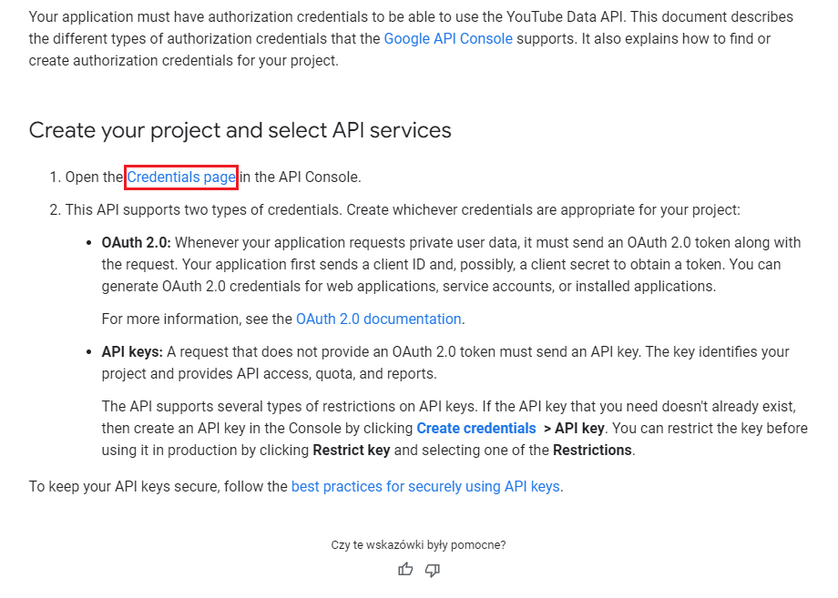

2. Set `Authorized redirect URIs` on `domain.com/authorization`

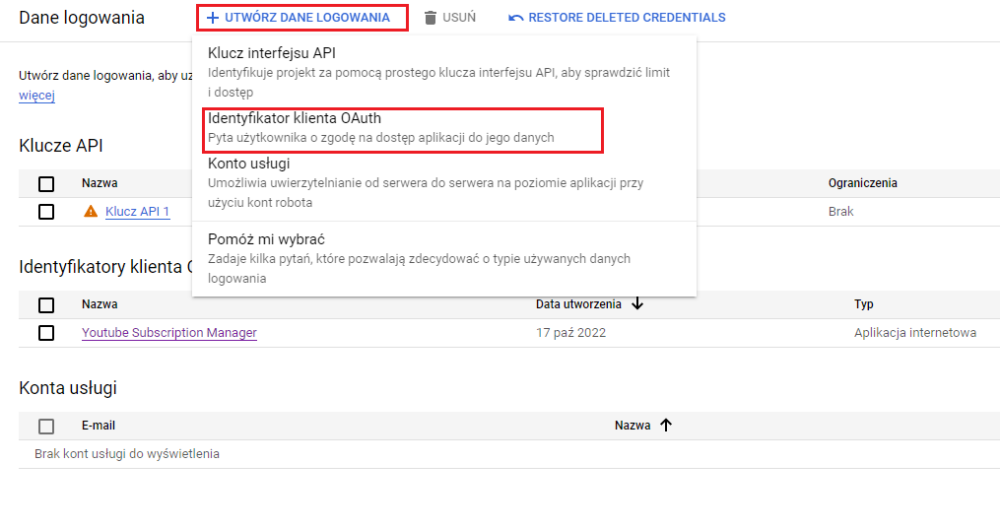

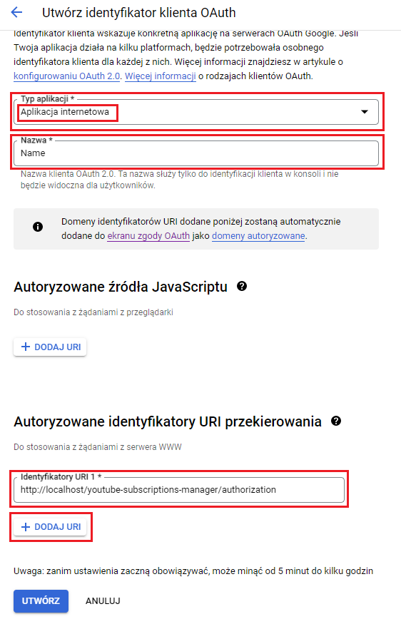

3. Download and place keys in root directory with name like `client_secret.json`,

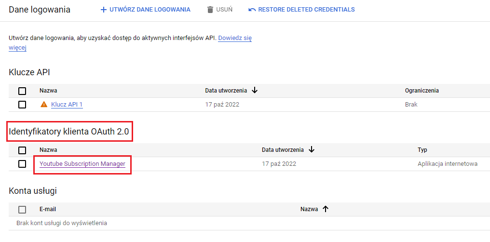

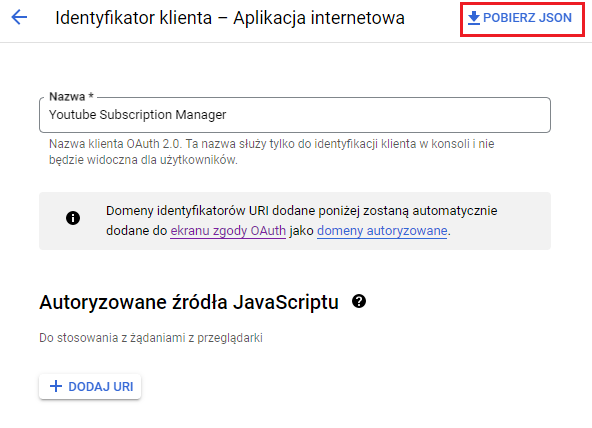

[YouTube Data API Overview](https://developers.google.com/youtube/v3/getting-started)

## Screenshots
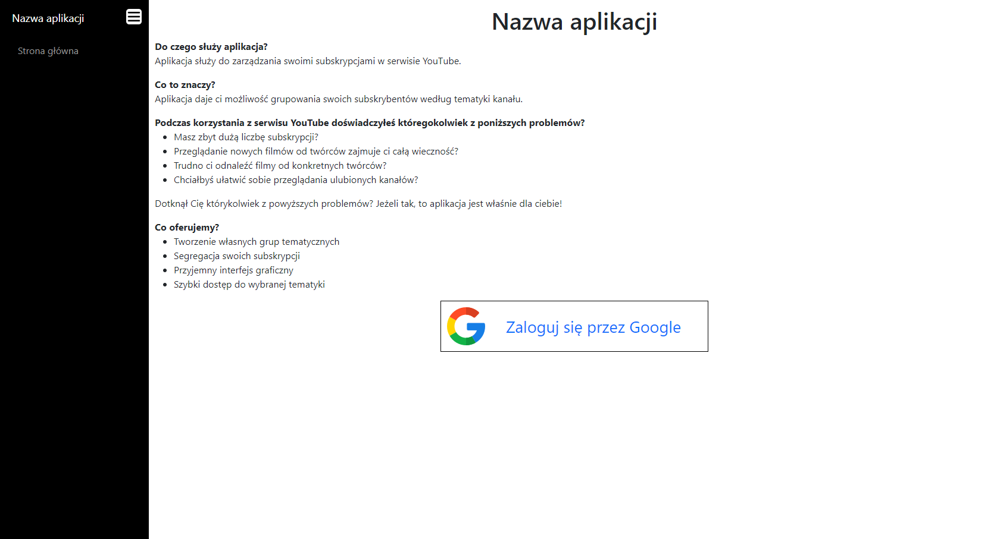

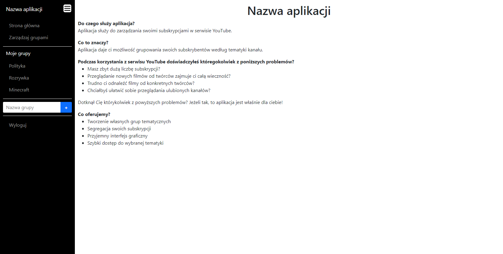

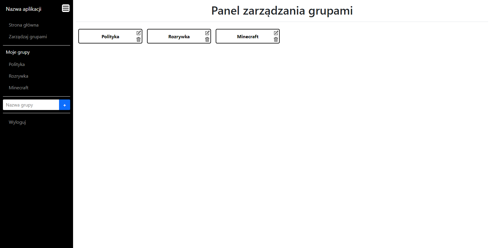

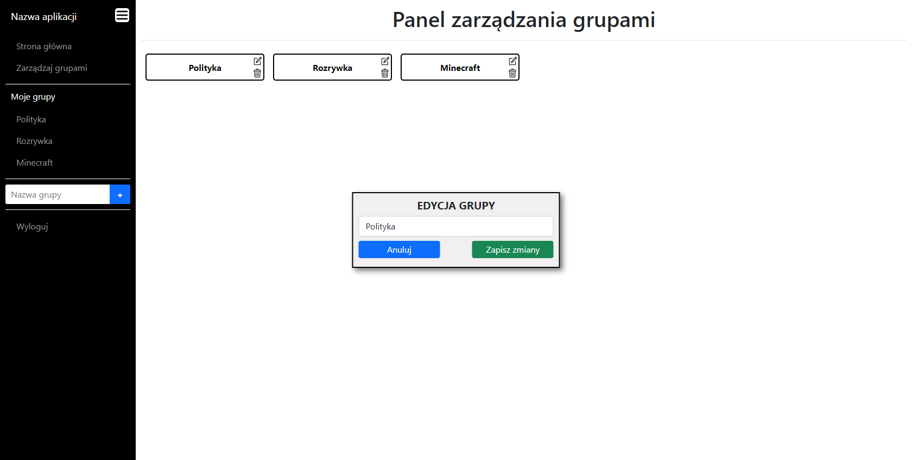

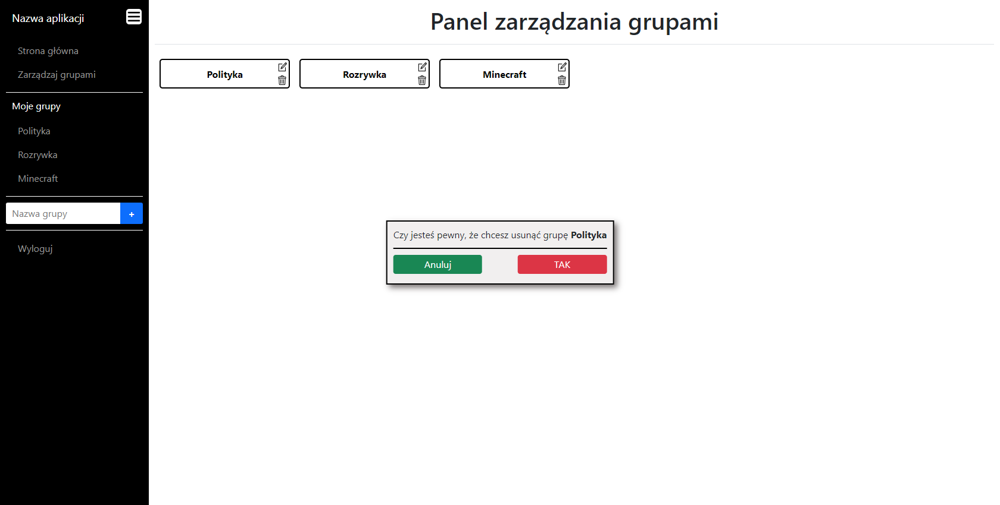

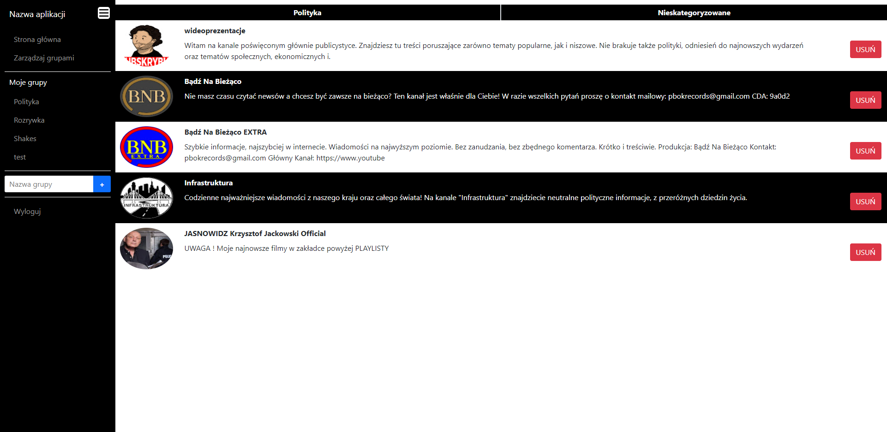

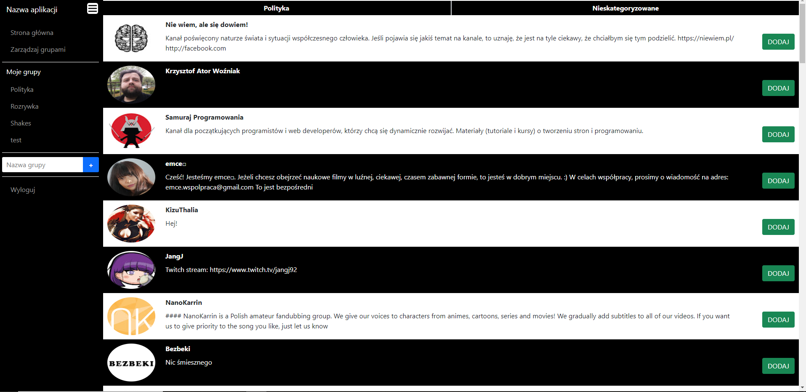

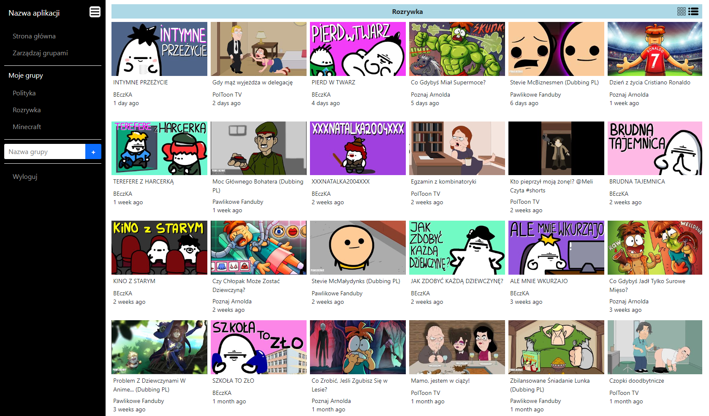

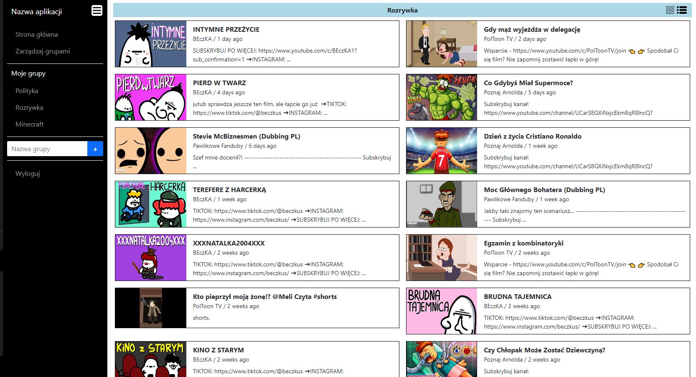
